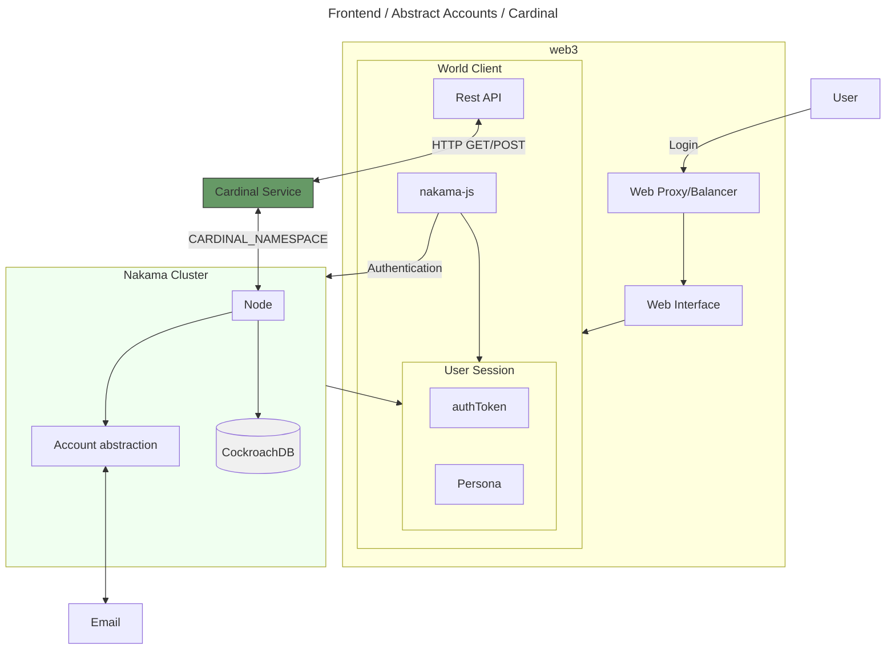
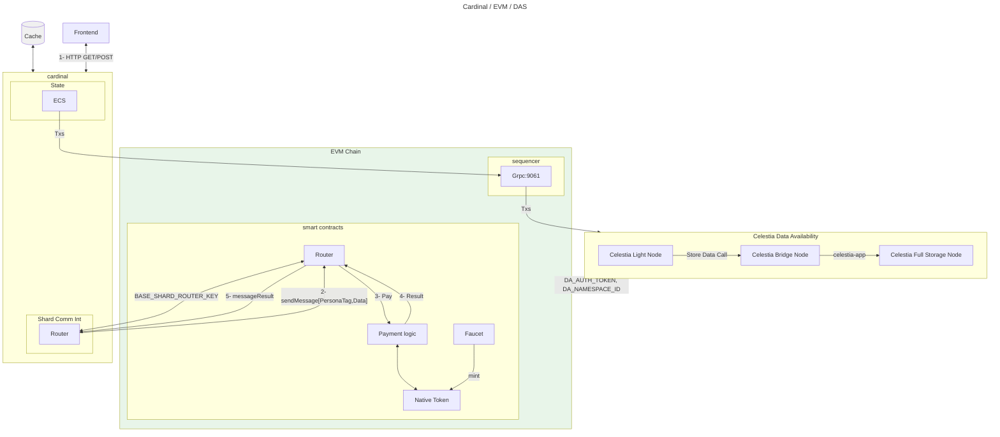

# MamaGotchi

## Architecture





## Explanation of the Diagram

### Core Services

- **CockroachDB**: Acts as the primary database for both the `game` and `nakama` services.
- **Redis**: Provides in-memory data storage for the `game` and `nakama` services.

### Blockchain Services

- **Celestia Devnet**: Serves as the blockchain node for the `chain` service.
- **EVM Chain**: Interacts with the `game` service to enable blockchain functionality.

### Game Services

- **Game Service**: Connects to `nakama`, `redis`, and `jaeger` for gameplay, data storage, and monitoring.
- **Nakama**: A server for handling game logic, connected to `cockroachdb`, `redis`, and `jaeger`.

### Monitoring & Tracing

- **Jaeger**: Collects tracing data from the `game`, `nakama`, and `chain` services for performance monitoring.

### Test Services

- **Test Nakama**: A test service that depends on the `nakama` server.

## Design

### Entity

- Pet
- LeaderBoard
- Food
  - Berrie
  - Snack
  - Yum
  - Pop
  - Honey
  - Munch
  - leaf
- Toys
  - Ball
  - Stick
  - Jump rope
- Habitats
  - park (walk)
  - forest (run)
  - beach (swim)
- care
  - injection
  - vitamins

### Component

- energy (sleeping, eating goes up, playing goes down) goes down over time
- life (sick: down, 100% hungry: down, eat: up, heal: stops going down, but doesn't go up). If you sleep
- wellness: go up by playing and is the property for the ranking.
- hygiene:
- DNA:

state:
    - bathing: reduces the possibility of illness and improves hygiene. Play low hygiene.
    - sick -> low life. With injection cure, it stops the constant damage of disease.
    - vitamins: increase life quickly.
    - food: increases energy.
    - energy: used to play, which increases wellness
    - sleep: energy rises, life rises slowly.
    - toys: wellness increases quickly.

## Installing World CLI

To begin your development journey with World Engine, you install
[World CLI](https://github.com/Argus-Labs/world-cli) a tool for creating, managing, and deploying World
Engine projects.

Install the latest world-cli release by running:

```bash
curl https://install.world.dev/cli! | bash
```

### Docker

Docker is used to make it easy to run the World Engine stack and its dependencies. If you don't already have Docker
installed, you can find instructions for your platform here:

[Installation instructions for Docker Desktop](https://docs.docker.com/compose/install/#scenario-one-install-docker-desktop)

## Getting Started

To use this template to start your own project, navigate to the directory where you want your project to live
and run:

```bash
world create
```

You will be prompted for a game name. A copy of the starter-game-template will be created in the current directory.

### Running Development Mode

World Engine dev mode provides a fast and easy way to run and iterate on your game shard.

To use it, navigate to your project directory and run

```bash
world cardinal dev
```

### Running World Engine E2E

To run the World Engine stack end-to-end (i.e. in production and game engine integration), run:

```bash
world cardinal start
```

This command will use the `world.toml` config specified in your root project directory to run both World Engine's
Cardinal game shard and Nakama relayer (for game engine integration).

Make sure to set `CARDINAL_MODE="production"` in world.toml to run the stack in production mode and obtain the best performance.

### Cardinal Editor

The Cardinal Editor is a web-based companion app that makes game development of Cardinal easier. It allows you to inspect the state of Cardinal in real-time without any additional code.

To access it, run `world cardinal start` or `world cardinal dev`

Then, open the [Cardinal Editor](https://editor.world.dev) in a web browser.

After you create some entities in your game, it will show up on the Cardinal Editor.

## Developing Your Game

For more details on how to create the game of your dream, visit the [World Engine documentation](https://world.dev)

## Testing

```bash
cd cardinal && go test --failfast -cover
```

## Endpoints

- [nakama](http://localhost:7351/)
- [Cardinal Editor](http://localhost:3000/)